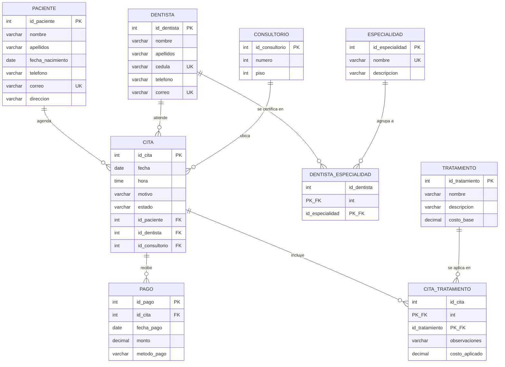

# Fase 2. Modelado conceptual

## Diagrama Entidad-Relación

El diagrama incluye las nueve entidades del modelo (siete de negocio y dos tablas puente para las relaciones N:M), sus atributos con llaves primarias y foráneas, y las cardinalidades con notación de pata de gallo.

## Lectura del diagrama

| Relación | Cardinalidad | Lectura |
|---|---|---|
| Paciente - Cita | 1:N | Un paciente agenda 0 o muchas citas; cada cita pertenece a exactamente un paciente. |
| Dentista - Cita | 1:N | Un dentista atiende 0 o muchas citas; cada cita es atendida por un solo dentista. |
| Consultorio - Cita | 1:N | En un consultorio se llevan a cabo 0 o muchas citas; cada cita ocurre en un solo consultorio. |
| Dentista - Especialidad | N:M | Un dentista puede tener varias especialidades y una especialidad la pueden tener varios dentistas. La relación se materializa en la tabla puente `Dentista_Especialidad`. |
| Cita - Tratamiento | N:M | En una cita se aplican uno o varios tratamientos y un tratamiento puede aplicarse en varias citas. La relación se materializa en `Cita_Tratamiento`, que además guarda observaciones y el costo aplicado. |
| Cita - Pago | 1:N | Una cita puede recibir 0 o varios pagos parciales; cada pago corresponde a una sola cita. |

## Notas sobre la notación

- `PK` indica llave primaria.
- `FK` indica llave foránea.
- `PK_FK` indica que el atributo es a la vez parte de la llave primaria compuesta y llave foránea (caso de las tablas puente).
- `UK` indica restricción UNIQUE a nivel de columna (no es llave primaria pero el valor no se repite).
- La notación `||--o{` se lee como "uno y solo uno" del lado izquierdo y "cero o muchos" del lado derecho.

## Justificación de las dos tablas puente

`Dentista_Especialidad` y `Cita_Tratamiento` aparecen como entidades propias porque sus relaciones originales son N:M y eso no se puede modelar de forma directa en una base de datos relacional. Convertirlas en tablas puente permite:

- Almacenar pares válidos sin duplicar datos.
- Llevar atributos propios de la relación, como `costo_aplicado` y `observaciones` en `Cita_Tratamiento`.
- Cumplir con la primera forma normal en la fase siguiente.
